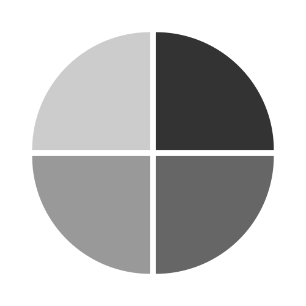

<!-- ## CGLab @ IMBB-FORTH   -->
{:style="max-width: 10%; height: auto;"}
[Comparative Genomics Lab](https://www.imbb.forth.gr/en/research/Alexandros-Pittis.62/){:target="_blank"} is based at the Institute of Molecular Biology and Biotechnology of the Foundation for Research and Technology Hellas (IMBB-FORTH) in Heraklion, Crete.
{: .welcomefont} 

We are an interdisciplinary biology research group, part of the [Evolution, Development & Cell Biology](https://www.imbb.forth.gr/en/research/lab-Evolution-Development-Cell-Biology.4/){:target="_blank"} division of the institute.
{: .welcomefont}

Our research is focused on **computational biology**, **comparative genomics** and **single-cell/nucleus transcriptomics** methods to address questions on **sequence** and **functional Diversity**, **genome**, **protein/gene family**, and **cellular Evolution**.
{: .welcomefont}

The lab is located at the [main building](https://maps.app.goo.gl/8AmNF7YQPdxtm8mK7){:target="_blank"} of FORTH.
{: .welcomefont}
