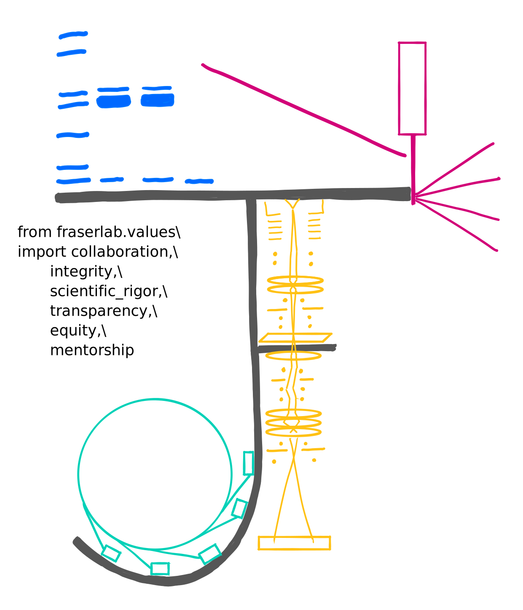

# CGLab @ IMBB-FORTH  
{: .display-6}
[Comparative Genomics Lab](https://www.imbb.forth.gr/en/research-en/item/7417-alexandros-pittis) is hosted at the Institute of Molecular Biology and Biotechnology of the Foundation for Research and Technology Hellas (IMBB-FORTH) in Heraklion, Crete. We are an interdisciplinary biology research group, part of the [Evolution, Development & Cell Biology](https://www.imbb.forth.gr/en/research-en/evolution-development-cell-biology) division of the institute.
{: .welcomefont}

[//]: # {:style="max-width: 100%; height: auto;"}

Our research is focused on **computational biology**, **comparative genomics** and **single-cell/nucleus transcriptomics** methods to address questions on **genome**, **protein/gene family**, and **cellular evolution**.
{: .welcomefont}

We are located at the [main building](https://maps.app.goo.gl/8AmNF7YQPdxtm8mK7){:target="_blank"} of FORTH.
{: .welcomefont}
