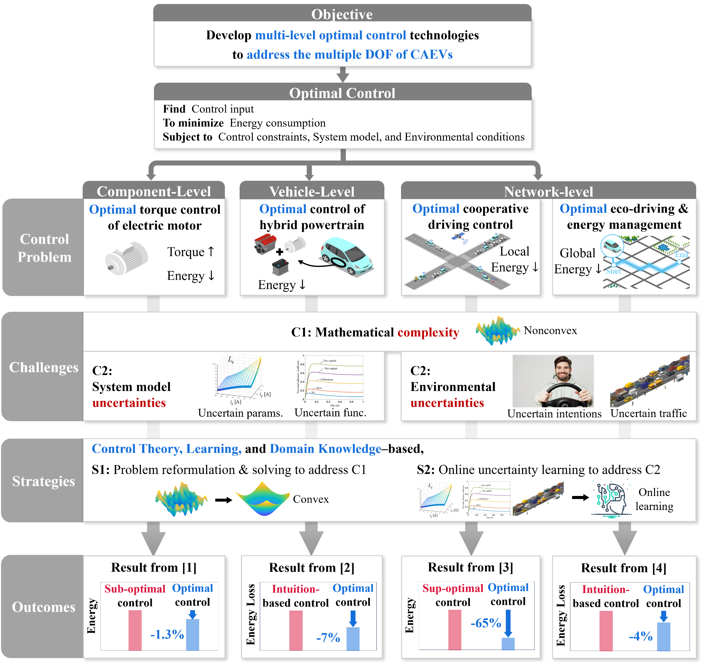

# Welcome to the __MIC Lab__!
{: .display-4}
 
The <b>Mobility Intelligence & Control Laboratory (MIC Lab)</b> are part of the [Cho Chun Shik Graduate School of Mobility (CCS Graduate School of Mobility)](https://mo.kaist.ac.kr) at [Korean Advanced Institute of Science and Technology (KAIST)](https://www.kaist.ac.kr/kr/).
<!-- {: .welcomefont} -->

We Control __CAEVs__ across __Multiple Levels__ based on __Learning + Control Theory__.
<!-- {: .welcomefont} -->

{:style="max-width: 100%; height: auto;"}
