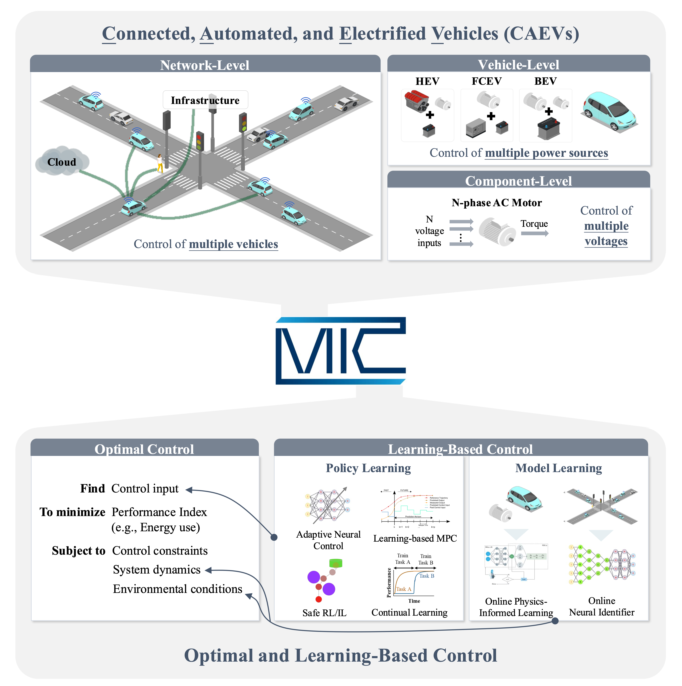

  
## <b>Mobility Intelligence and Control Laboratory</b>
<!-- {: .welcomefont} -->
#### KAIST CCS Graduate School of Mobility
<!-- {: .welcomefont} -->

 

The Mobility Intelligence and Control Laboratory (MIC Lab) focuses on enabling mobility intelligence through optimal and learning-based control of Connected, Automated, and Electrified Vehicles (CAEVs) across multiple levels of control.
<!-- {: .welcomefont} -->

  

