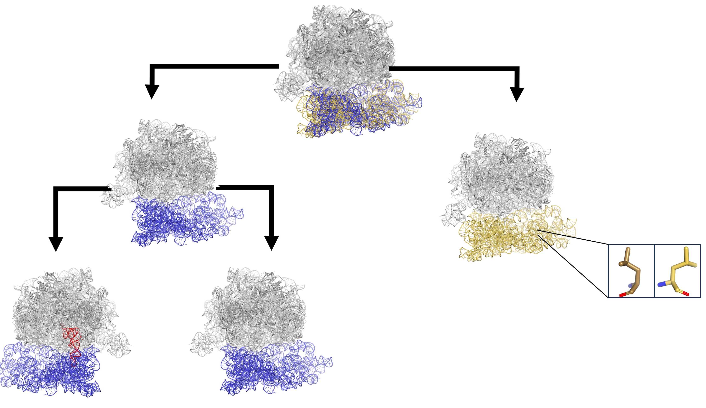

# Conformational Ensembles: Statistical Structural Biology

{:style="max-width: 100%; height: auto;"}

 
Statistical structural biology seeks to move beyond the classic single-dataset-single-structure paradigm. The most compelling questions in structural biology, such as elucidating the dynamics of transient biological events, understanding allostery, and investigating how binding events alter the protein conformational landscape, cannot be effectively addressed with a single structure alone. To tackle these challenges, we must embrace large-scale data analysis, statistical interpretation of conformational ensembles, and explore the modeling relationships between multiple maps and models. 

 
 
The workshop will take place on June 8th/9th at UCSF Mission Bay. For more details, please visit the [information tab](/information). 

Please head to the [registration tab](/register) to register.

**Organizers:**

[Stephanie Wankowicz](https://wankowiczlab.com/)
 
[James Fraser](https://fraserlab.com/)

