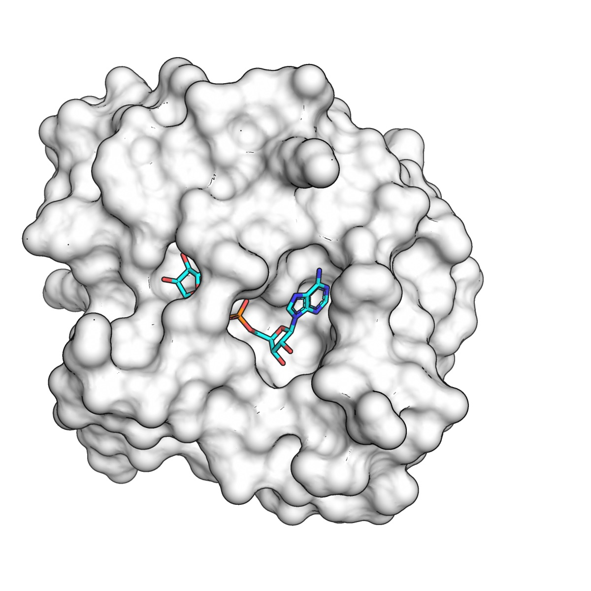
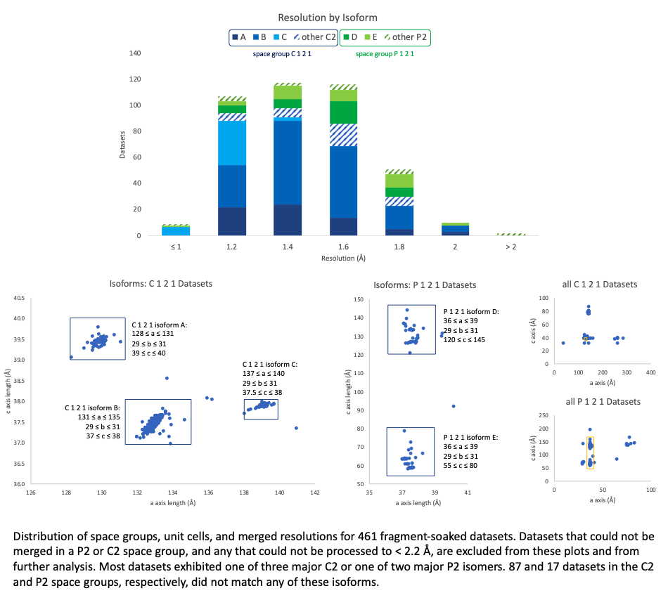
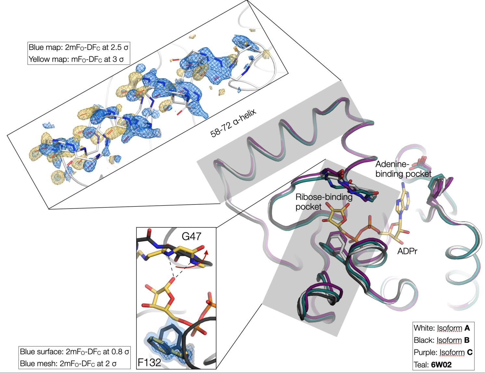
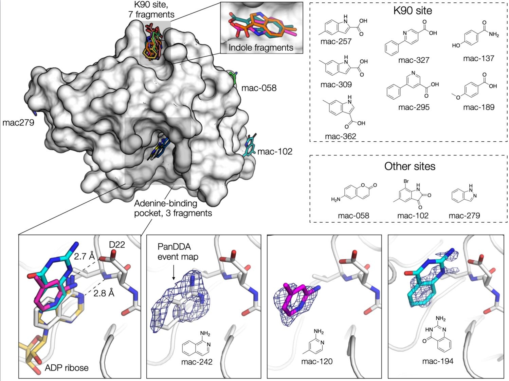
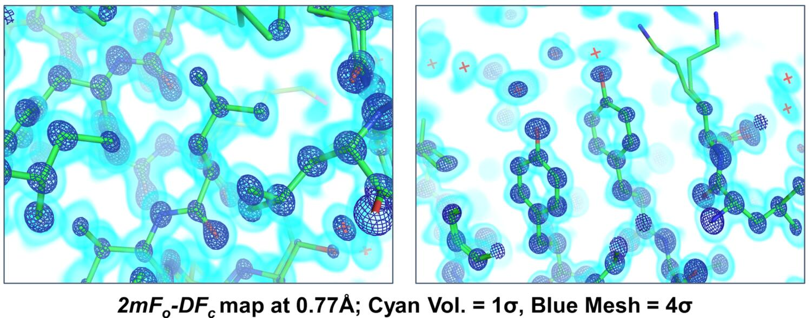
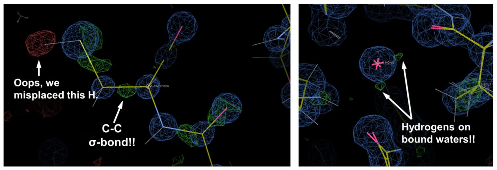
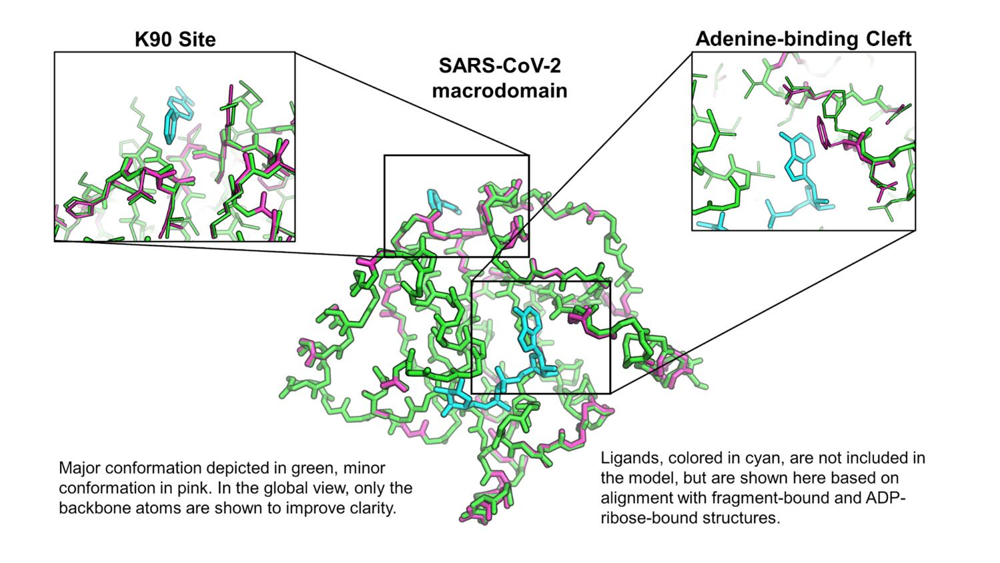
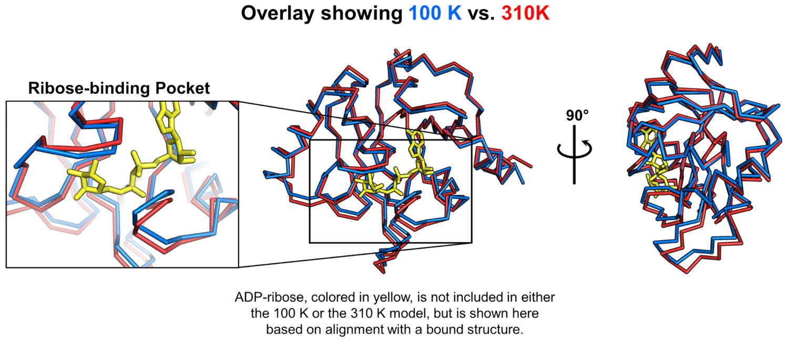
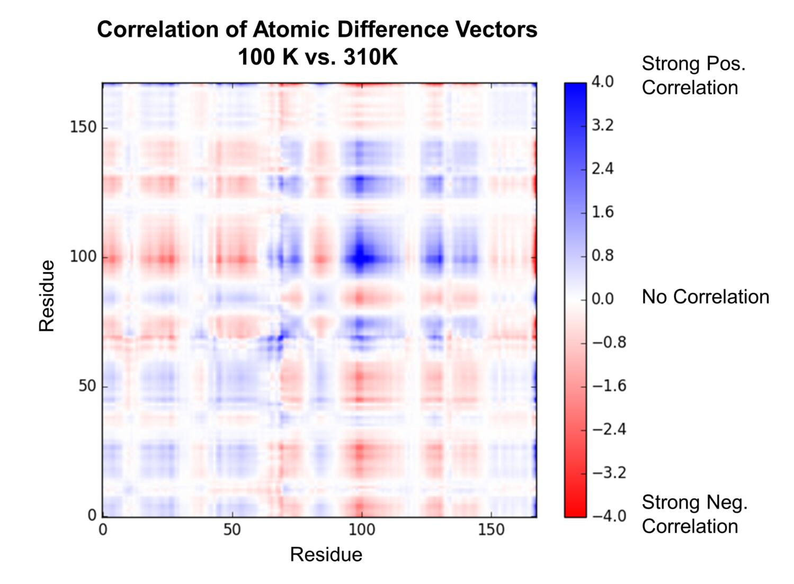
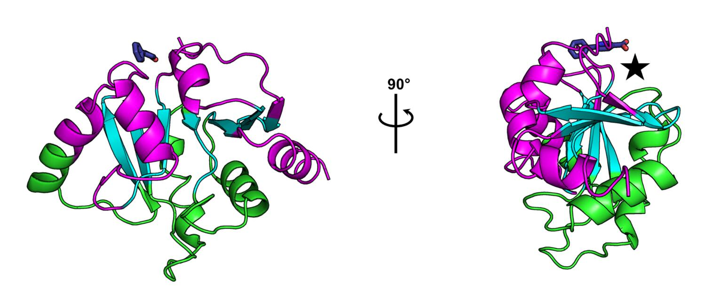

# Identifying new ligands for the SARS-CoV-2 Macrodomain by Fragment Screening and Multi-temperature Crystallography

## Context

The [QBI Coronavirus Research Group](http://qbi.ucsf.edu/QCRG/overview) is a group of UCSF scientists who came together to work on COVID-19. Initially, this work was centered around creating and analyzing the host-viral protein-protein interactome and drug repurposing efforts, recently published by the [Krogan group and a large team of collaborators](https://doi.org/10.1038/s41586-020-2286-9).  Stemming from that initial work, the [QCRG Structural Biology Consortium](http://qbi.ucsf.edu/qcrg/structuralbiology) was formed, with three major goals:

* Visualize host-viral protein complexes that were identified through interactome studies.
* Understand and engineer the binding modes of neutralizing biologics [studied at UCSF](https://www.biorxiv.org/content/10.1101/2020.05.21.109157v1).
* Empower chemists to find new small molecules against viral and host targets through structure-based virtual screening and fragment campaigns.

Since our collaboration with Frank von Delft and the X-Chem team [on PTP1B](https://www.ncbi.nlm.nih.gov/pmc/articles/PMC6039181/), we in the Fraser lab, have been slowly building up capabilities for a “mini-X-Chem-West” at UCSF, using the facilities in the [Macromolecular Structure Group crystallization facility](https://msg.ucsf.edu/), the [Small Molecule Discovery Center](https://pharm.ucsf.edu/smdc), and [ALS Beamline 8.3.1](http://tomalbertron.org/), supported by [ALS-ENABLE](http://als-enable.lbl.gov/), and [SSRL Beamlines 12-1 and 12-2](https://smb.slac.stanford.edu/). These resources were further knitted together recently by a [Technology, Methodology, Core grant from PBBR](https://pbbr.ucsf.edu/).  Inspired by the urgent need to identify chemical matter that can be developed for antiviral therapies, and by the amazing work at [Diamond Light Source on SARS-CoV-2 Main protease (Mpro)](https://www.diamond.ac.uk/covid-19/for-scientists/Main-protease-structure-and-XChem.html), we saw an opportunity to put our new capabilities to use in the QCRG Structural Biology Consortium.

## Targeting Nsp3 Macrodomain

Recognizing that many groups around the world were working hard on drugging the viral proteases, we wanted to target another enzyme with our fragment screen. Discussions with Alan Ashworth, Brian Shoichet, and their labs motivated us to select the enzymatic macrodomain of the Nsp3 viral protein. The enzymatic activity of this ~170 amino acid domain suppresses the host immune response by cleaving poly-ADP-ribose chains from post-translationally modified proteins. In 2016, [Fehr, et al](https://mbio.asm.org/content/7/6/e01721-16.abstract), demonstrated that in a mouse model of SARS-CoV infection, mutation of the macrodomain attenuated the virus, and the infected mice survived the infection without damage to lung tissue. Following up on that work, [Grunewald, et al](https://journals.plos.org/plospathogens/article?id=10.1371/journal.ppat.1007756), showed that coronavirus replication was enhanced in poly-ADP-ribose polymerase (PARP) deficient macrophages, and that this effect was mediated by the enzymatic activity of the macrodomain. These important studies established this enzymatic protein domain as a potential antiviral drug target for SARS-CoV infection. Unfortunately, there are currently no small molecule inhibitors of the Nsp3 Macrodomain and there is only structural information for its natural ligands bound to the active site. To be able to develop inhibitors for it, we need to visualize how non-natural small molecules interact with the active site. Crystallographic fragment screening could provide these starting points, kickstarting other discovery efforts, including virtual screening.

## A massive team effort and some good luck

Despite the complications from the COVID-19 shutdown we began working on the macrodomain through the QCRG Structural Biology Consortium pipeline, which has been organized by Oren Rosenberg and Klim Verba. Constructs designed by Roberto Efraín (Robbie) Díaz were synthesized, cloned, and arrived in our laboratory on April 11. Robbie, Aye Chan Thwin and Greg Merz immediately expressed the protein and handed the cells off to Tristan Owens, who successfully purified the protein on his first try. On April 17, initial crystallization experiments were prepared by Ursula Schulze Gahmen in the MSG facility run by Liam McKay, and crystals were identified within days. Ursula also quickly discovered that microseeding was key for crystal reproducibility. Around this time, the ALS was just reopening exclusively for COVID-19 remote access  research projects, and we were lucky to be the first group to get access to BL8.3.1 on April 29. Data collection by Mike Thompson, with amazing remote support from George Meigs and James Holton, identified a crystal form that diffracted to high-resolution (beyond 1.0 Å in some cases!!) and appeared suitable for fragment soaking. Over the next two weeks, Galen Correy, working with Justin Biel and Liam, optimized crystal soaking into DMSO using the ECHO acoustic droplet ejector in the SMDC. Weekly beamtimes at BL8.3.1 (on May 7 and May 14) with data collection by Mike allowed us to test how the DMSO soaking affected X-ray diffraction. We identified soaking conditions that were “tolerated” well by the crystals, based on the observation that the diffraction signal remained strong, and (perhaps foolishly) we decided to push forward with our fragment screen.

The following week, on May 21 we collected approximately 50 data sets from crystals that were soaked in DMSO alone (no fragments yet) to establish a baseline for identifying fragments with the PanDDA method. At this point, we were starting to generate a lot of data, which was expertly managed, processed, and analyzed by Iris Young. With a large sample size, we noticed that the exposure to DMSO created substantial non-isomorphism, although we surmised that we could cluster the data into isomorphous groups and still perform the PanDDA analysis successfully (more on this later). With the necessary apo data in hand, Galen undertook a heroic effort to grow, soak, and freeze 411 unique crystals within the 72 hours spanning May 26-28. This covered the [Enamine Essential Fragment library](https://enamine.net/fragments/plated-libraries/essential-library) and a small custom UCSF library that we are building out with John Irwin. Of course, all of this work relied on a continuing supply of high-quality protein samples, provided by Tristan, now with help from Jessica Peters and Michelle Moritz. Data collection from >400 crystals is no small task, and over the next three days (May 28-30) Mike and Galen, with additional help from Ishan Deshpande, simultaneously operated two beamlines — BL8.3.1 at ALS and BL12-2 at SSRL (thanks to Aina Cohen and Silvia Russi there!) — to collect 375 datasets (163 at ALS and 212 at SSRL). Since we didn’t get all 411 fragments on our first try,  on June 3 we had one last beamtime to collect data for the fragments we missed out on during our first attempt. While we were generating all of this data, Iris was hard at work processing it, and clustering datasets into isomorphous groups.

As we were finalizing our data, we got in touch with [Frank von Delft and the X-Chem crew](https://www.diamond.ac.uk/Instruments/Mx/Fragment-Screening.html) (since James Fraser was finishing edits to a review on fragment-based methods together with Frank!) and learned of the awesome Macrodomain effort by Ivan Ahel’s lab in collaboration with X-Chem that is also being released today. Ivan and his lab are experts in the biochemistry of macrodomains. We quickly got on a call, compared notes, and agreed to release our data together. The first conclusion is that they generated a subtly different construct that allowed crystallization in a much better crystal form for fragment screening. In their construct, both the N-terminal serine (green spheres in the figure below, left panel), and the C-terminal leucine (blue spheres in the figure below, right panel), make key crystal contacts. Specifically, the N-terminus participates in a contact between three molecules, and the C-terminus tucks neatly into a pocket on the surface of a neighboring molecule.

Our construct has several additional residues at both termini, precluding formation of those contacts. Their crystal form has a higher DMSO tolerance, is more reproducibly isomorphous, and most importantly, has a more accessible active site for soaking. They performed a larger experiment than we did (~1200 soaks) and generated more hits overall and bound to the active site. We are excited to learn from them and to keep the communication open between our groups for the followup experiments, and to keep crystallography and computational chemistry efforts going on both continents — international science for the win!

## Summary of the fragment screening results

### Data statistics
We could consistently merge our fragment datasets to high resolution (nearly always < 2 Å, although it occasionally took a couple tries to get there). We were less fortunate when it came to crystal forms: the predominating C2 symmetry was sometimes broken, resulting in P2 space group crystals, and for each of these space groups, several isoforms emerged, varying by up to 25 Å in unit cell parameters even within what we designate here as one "isoform." There are also substantial clusters of datasets for which one unit cell parameter appears to be doubled, but reprocessing with what the parameters ought to be (if the doubling is in fact misindexing) was unsuccessful — we can only conclude that this crystal form is highly susceptible to perturbations to the crystal lattice.

### Isomorphism
Intrigued by the C121 nonisomorphism, we looked to identify structural differences between the isoforms. The main difference involves a shift in the loops that define the ribose-binding site. The binding site entrance of isform A is 2 Å wider compared to isoform C. Although minor, this structural difference may affect active site access. Notably, rotation of the Phe132 side-chain is required for ADP-ribose binding, and this residue sits on the loop with the largest structural variation across our isoforms. Both open and closed conformations of Phe132 are apparent in the electron density for isoform B. Another structural difference between the isoforms is the orientation of residues 58-72, which form an α-helix on the surface of the protein. This helix is rotated by 2 Å between isoforms B and A/C. Surprisingly, in some of the B crystal structures, we see clear electron density for both helix conformations. It’s tempting to speculate that this helix rotation may be involved with the peptide flip of Gly47 that occurs with ADP-ribose binding, however, there is no obvious allosteric connection between the 58-72 α-helix and the ribose binding site.

Although challenging for data reduction and fragment identification, the difference macrodomain isoforms allowed us to visualise the conformational changes associated with ADP-ribose binding. As we have repeatedly shown in previous work, X-ray crystallography can be a powerful tool for capturing conformational substates. Collecting datasets from multiple crystals (perhaps not 400, but 10-20 is a reasonable goal given that we routinely collect datasets in < 2 min), can reveal distinct conformations, especially when combined with ligand or temperature perturbation (more below). It may be that conformational changes attributed to ligand binding are present in the apo protein as well. Of course, this won’t give you information on whether a conformational change is important for ligand binding or whether this information can help ligand/drug design — that’s the hard part — but it will help to visualize the different conformations accessible to a protein and will help us to move toward a dynamic view of structural biology. Proteins move!

## Fragment analysis

Using the data processed by Iris, Galen used PanDDA to search for fragments in the electron density maps, ably assisted by Justin. Best results were obtained by running the analysis separately on each of the three isoforms. Ideally, we would have collected a set of “true” DMSO-only datasets for each isoform; however, because we only became aware of the seven(!) major isoforms after we collected the fragment datasets, we felt the best option was to perform the analysis with the datasets we had in hand. We selected between 20-40 datasets for each isoform (based on resolution and RFree) and performed a round of PanDDA with hits classified using the default PanDDA thresholds (cluster size = 80). This initial run yielded 6 fragments. We then recalculated the background map, excluding any datasets containing fragments, and repeated the search for fragments using a lower threshold to classify a hit (cluster size = 40). Although this gave hundreds of false positives, we were able to identify an additional 7 fragments. Three of the fragments were located in the adenine-binding pocket, seven in a shallow hydrophobic cleft near Lys90 (the K90 site), and the remaining three fragments in three different sites on the surface of the protein. We continue to be amazed at how powerful PanDDA is for the identification of low-occupancy fragments, as inspection of the input maps revealed that there was almost no evidence for fragment binding.

**You can interactively explore fragments uncovered by both our effort and the Ahel/X-Chem effort at [Fragalysis](http://fragalysis.diamond.ac.uk/)**

### Fragments in the adenine binding site

The three active-site fragments were located in the adenine-binding pocket. The amino isoquinoline engages the protein in the same way as adenine: the aromatic nitrogen forms a 2.8 Å hydrogen bond with the backbone nitrogen of Ile23, and the primary amine forms a 2.7 Å hydrogen bond with the Asp22 side-chain. The remaining two active site fragments bind in the same plane as the isoquinoline, but with different hydrogen bonding to Asp22. The Ahel/X-Chem effort has 55 fragments bound in the active site. Collectively, these are a lot of great starting points for structure-based design.

### Fragments in the K90 site

Seven of the fragments bind to a site ~20 Å away from the adenine-binding pocket. The fragments bind in a shallow pocket formed by two lysines (K90 and K31) and a valine (V3). Fragments bind through a combination of hydrophobic interactions, and hydrogen bonds with the side chain of Thr33 or the backbone carbonyl of Lys31. Although three of the fragments have the same indole scaffold, the binding mode and the position of the indole nitrogen is not conserved (although it should be said that the quality of the electron density maps makes differentiating between the different orientations difficult).

### Other sites

Two of the remaining fragments bind to sites where DMSO binds in other structures. One of these fragments (mac-058) hydrogen bonds to the backbone nitrogens of Gly8 and Tyr9, while the other fragment (mac-279), sits at the base of the 58-72 α-helix. The final fragment (mac-102) sits in a shallow depression on the surface of the protein.

## Ultra-high resolution data, diffraction at physiological temperature, and enzyme dynamics

Although our crystal form was somewhat suboptimal for fragment screening, it turned out to have one major benefit - the native crystals (no DMSO exposure) diffract to astonishingly high resolution (0.77 Å!!). To collect the very high resolution data efficiently, we performed two data collection runs for each of several crystals. First, we performed a “high-resolution” run, using high energy (17 keV) and the minimum possible sample-to-detector distance. During the high-res runs, low resolution reflections were prone to overlaps, so we also collected a second “low resolution” run at lower energy (11111 eV) and with a longer sample-to-detector distance. Paired datasets from several crystals in different orientations were merged using appropriate resolution cutoffs to obtain a single data set. The ultra-high resolution diffraction allowed us to do some cool analysis that revealed widespread conformational changes in the enzyme, and resulted in a few interesting hypotheses about the enzyme’s catalytic cycle. First, we did the “simple” thing, and created a high-resolution model of the enzyme by iterative cycles of manual model building and automated refinement against the 0.77 Å data. Electron density maps at true “atomic resolution,” where each atom appears as its own separate sphere, are truly breathtaking.

In this case, we could even see features in the mFo-DFc difference maps that corresponded to hydrogen atoms and bonding densities!

Of course, all of these features needed to be accounted for in the refinement, and we needed to use some of the more esoteric features in phenix.refine, including unrestrained coordinate refinement, anisotropic B-factor refinement, refinement of individual hydrogen atom positions, and even an “interatomic scatterer” model to explicitly account for the electron density located in covalent bonding orbitals. This “traditional” model building and refinement allowed us to model a lot of alternative conformations in noteworthy regions of the enzyme. Examples included a flexible loop and Phe residue (F156) that form part of the adenine binding cleft (see figure below, right panel), and we also saw significant backbone and sidechain heterogeneity at the K90 fragment-binding site identified in our screen (see figure below, left panel).

Since we’re generally very interested in trying to understand how proteins move, we wanted to follow up on these observations, and attempt to model conformational heterogeneity in a more objective way. We turned to Phenix ensemble refinement, which uses X-ray diffraction data to restrain an accelerated molecular dynamics simulation, and subsequently produce an experimentally-derived ensemble model. The ensemble model (see figure below) recapitulated the flexibility that we manually modeled into the electron density maps, and also showed significant flexibility in a small loop-helix region (magenta in the figure, F156 in orange) that lies between the K90 site and the adenine binding cleft.

Most structural biology, including our work with the macrodomain to this point, is done using cryocooled samples (~100 K), and we thought it would be interesting to see what this enzyme looked like at physiological temperature (37 ºC, or 310 K). Our past (and current!) work has shown that temperature perturbation, in this case comparing structures determined at 100 K and 310 K, can be a useful tool for understanding protein conformational landscapes and mapping protein motions. To this end, we are always working with beamline scientists to develop capabilities for “multi-temperature” X-ray data collection. On May 5, the SMB staff at SSRL (Aina and Silvia, mentioned above for their contribution to our fragment work, and also Jeney Wierman) helped Mike remotely collect data from macrodomain crystals at 310 K, as the [first user](https://twitter.com/mctucsf/status/1257841001248337920) of the brand new BL12-1 at SSRL. These initial measurements allowed us to troubleshoot some issues with data collection at these temperatures. A  little more than a month later, George was able to get this capability online at ALS BL8.3.1 for remote access (no small feat), and on June 19 Mike collected data that yielded a 1.5 Å structure at 310 K. Data collection at these elevated temperatures is tricky, because radiation damage is severe. The data have to be collected very “gently,” using a low X-ray dose, which is the source of the large discrepancy in resolution between the data at 100 K and 310 K. But you can still see a lot at 1.5 Å! We noticed immediately that there were some pretty large differences in the protein backbone when comparing the 100 K and 310 K structures. Specifically, the cryocooling appears to “squish” the enzyme, causing a notable collapse of the ribose binding pocket. We think these differences between cryocooled and physiological structures could be especially important for computational chemists who are performing virtual screening against this target.

To characterize the temperature-dependent differences, we aligned the 100 K and 310 K structures, calculated vectors between corresponding atoms in the two structures, and looked at the projections of those vectors onto one another to see if any of the apparent conformational changes were correlated.

This analysis showed a pattern of correlated and anti-correlated atomic displacements that indicated the enzyme can be roughly characterized as having two “domains,” with an apparent hinge-bending motion, consistent with our visual observations. This type of “hinge-bending” or “clamshell” motion has been studied extensively in other enzymes and solute-binding proteins (most famously lysozyme and maltose-binding protein). Interestingly, our ensemble refinement against data collected at 100 K captured some, but not all, of the global rearrangement that we detected by assessing the effect of temperature.

The observation of multiple fragment binding events at the K90 site, combined with our insights into the dynamics of the enzyme, is prompting us to ask whether or not this site might hold the capacity to allosterically modulate the activity of the enzyme, despite its distance from the active site. From our correlation matrix describing temperature-dependent structural changes, we can identify two domains whose motions are well-correlated internally, and anticorrelated with one another, which are colored green and magenta in the figure below. Additionally, there are regions that show low correlation to all other parts of the structure, colored cyan in the figure, which generally map to the central β-sheet. The K90 site identified in our fragment screen is close to a hinge point in the macrodomain, denoted by the star in the figure below. The locations and poses of small molecules bound in the K90 site make us hopeful that elaboration of these fragment hits could result in lead compounds capable of manipulating the hinge-bending motion of the enzyme.

Of course, the possibility of allosteric control of the enzyme is highly speculative at the current stage of the project, but our observations provide us with a set of specific, mechanistic hypotheses about function and inhibition that we look forward to testing in the near future (see below).

## What’s next?

We will be depositing our fragment-bound structures to the PDB, posting MTZs of non-hit datasets to Zenodo, and uploading images of as many datasets as we can to the [Integrated Resource for Reproducibility in Macromolecular Crystallography](https://proteindiffraction.org/). Eventually we will post a preprint and submit to a journal for peer review as well. But, since these are the first non-natural ligands to SARS-CoV-2 macrodomain, we wanted to release the data now! We also plan to post data and coordinates for the ultra-high resolution and physiological structures ASAP, hopefully in the coming days.

In the wetlab, we will be using the Ahel lab crystal form to re-screen our fragments (generating a study on the success of various fragments across crystal forms, both of which diffract to very high resolution, which we think will be very interesting). In collaboration with the Ashworth, Gestwicki, and Shoichet labs, we will also be attempting co-crystallization and soaks for compounds identified by biochemical screening, virtual screening, and derivatives from the bound fragments. We plan to keep the lines of communication with Ahel lab (and the rest of the scientific community) open — and update our progress transparently. Indeed, in addition to QBI support for this project, we received an NSF RAPID award where we outlined ideas about how to make the communication of our results even faster than preprints! We hope to be able to update you on exciting new compounds and results in the weeks to come.

## Links to data:
* Explore hits at Fragalysis
* [Google Spreadsheet of all ligands soaked with smiles strings](https://docs.google.com/spreadsheets/d/1CesOLzheW0tuBXSQTmR61axZwZi7-d98CRVBHs9tVKI/edit?usp=sharing)
* [UCSF BOX Folder of PDBs, MTZs and Event/Z Maps of hits](https://ucsf.box.com/s/qjydo8sg2pdjhazekcj3fpud7lh3bo90)
* [UCSF BOX Folder of MTZs of non-hits](https://ucsf.box.com/s/78z31gag8rysikha23e52c13zle5git8)
* Link to Diamond Data
